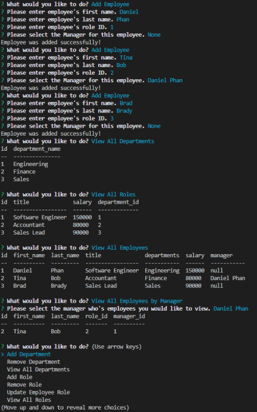

# Employee Tracker
## Table of Contents 
* [Project Description](#description)
* [Installation](#installation)
* [Usage](#usage)
* [Contributors](#contributors)
* [Tests](#tests)
* [License](#license)
* [Questions](#questions)

## Project Description
Employee Tracker is a command-line application that allows companies to manage their employees. This application utilizes node, inquirer, and MySQL. Business owners will be able to oversee and manage their company's employees. Furthermore, they will have the ability to add, remove, and view departments, roles, and employees. Along with, updating employee roles, employee managers, and viewing employees by manager. This is a great way for business owners to stay organized and lay out future plans and goals. 

Below is an example of the application's appearance:

## Installation
Before running the application, the user must execute the command "npm install" to install all of the required dependencies and packages. You're now all set to run this application!

## Usage
To execute this application, you will need to run the command "npm start" in the directory where "server.js" resides. You're now connected to the server and prompted with options on whether you want to add, remove, and view departments, roles, employees, and more. Select any option and you're on your way to managing the companies employees! 

Below is an example of the application's functionality and the results:

[Employee Tracker Demo](https://drive.google.com/file/d/1EYv5HvcZjaitNOJQ2ZTx69tZrqDYrpB7/view)

## Contributors
Please feel free to create pull requests. They will be reviewed before merging. If you would like to make any major changes, please open an issue to discuss these changes.

## Tests
No tests were created for this application.

## License
This project is licensed through MIT License 

## Questions
If you have any questions, please feel free to contact the owner of this repository. Their contact info is listed below:

### 
GitHub Username: dannyphan6 

GitHub Repository: https://github.com/dannyphan6 

Email Address: dannyphan@comcast.net